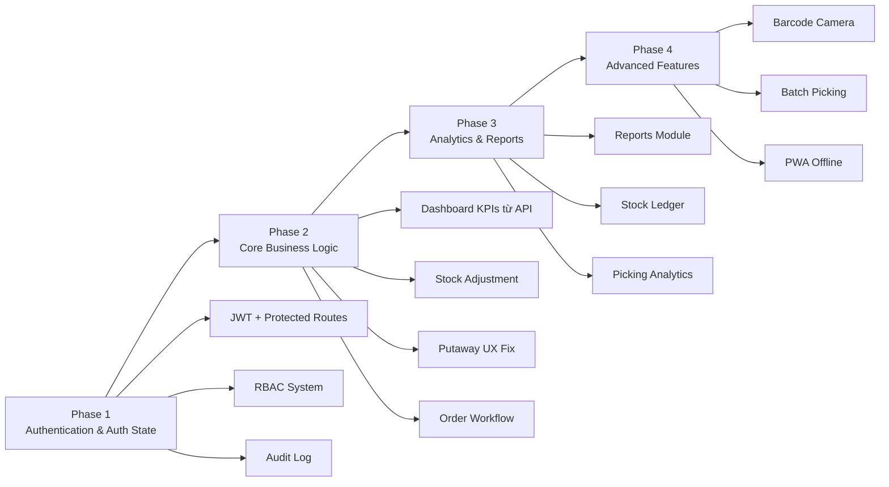

# 📊 Báo Cáo Phân Tích Kiến Trúc Hệ Thống
## StockMaster WMS — Frontend

> **Vai trò phân tích:** Kiến trúc sư hệ thống / Senior Frontend Analyst  
> **Ngày phân tích:** 07/04/2026  
> **Phạm vi:** `warehouse-management-frontend` (Next.js 14, TypeScript, RTK Query)

---

## 🗂️ Tổng Quan Module

| Module | Route | Trạng thái | Mức độ hoàn thiện |
|---|---|---|---|
| Dashboard Tổng quan | `/dashboard` | ⚠️ Dữ liệu tĩnh | 30% |
| Theo dõi tồn kho | `/inventory` | 🟡 Hoạt động một phần | 65% |
| Danh sách kho | `/warehouses` | 🟢 Hoạt động | 75% |
| Sản phẩm | `/products` | 🟢 Hoạt động | 80% |
| Nhóm / Danh mục | `/categories` | 🟢 Hoạt động | 75% |
| Đơn xuất kho | `/orders` | 🟡 Hoạt động một phần | 70% |
| Lấy hàng (Picking) | `/picking` | 🟡 Hoạt động một phần | 60% |
| Đơn nhập hàng (PO) | `/purchase-orders` | 🟢 Hoạt động | 80% |
| Phiếu nhập kho (Inbound) | `/inbound` | 🟢 Hoạt động | 75% |
| Putaway | `/putaway` | 🟡 Hoạt động một phần | 55% |
| Khách hàng | `/customers` | 🟢 Hoạt động | 75% |
| Nhà cung cấp | `/suppliers` | 🟢 Hoạt động | 80% |
| Vị trí lưu trữ | `/locations` | 🟢 Hoạt động | 70% |
| Nhật ký hoạt động | `/history` | ❌ Chưa triển khai | 5% |
| Báo cáo & Phân tích | `/reports` | ❌ Placeholder | 0% |
| Bảo mật & Phân quyền | `/security` | ❌ Chưa triển khai | 10% |
| Cài đặt hệ thống | `/settings` | 🟡 UI có, backend chưa | 40% |

---

## ❌ Các Chức Năng CHƯA Hoàn Thiện

### 1. 📊 Dashboard Tổng Quan (`/dashboard`) — **Dữ liệu tĩnh hoàn toàn**

```
Vấn đề cốt lõi: Toàn bộ KPI card đang dùng số liệu hardcoded
```

- **StatCards** (`Doanh thu ngày`, `Đơn hàng mới`, `Kho hàng nhập`, `Khách hàng mới`) — **fix cứng giá trị**, chưa kết nối API
- **Biểu đồ Lưu lượng xuất/nhập** — Chỉ là dữ liệu mẫu, comment rõ ràng: *"dữ liệu mẫu — kết nối API sau"*
- **Thông báo quan trọng** — Dùng mảng `NOTICES` với 3 thông báo được viết cứng trong code, không lấy từ backend
- **Tên người dùng** — `"Xin chào, An Nguyen!"` và `"An Nguyen / Warehouse Manager"` trong sidebar hoàn toàn hardcoded — **chưa tích hợp auth context**

---

### 2. 🕐 Nhật Ký Hoạt Động (`/history`) — **Chưa triển khai**

> Chỉ có `EmptyState` placeholder, không có API service nào cho audit log, không có component nào xử lý dữ liệu lịch sử.

**Thiếu toàn bộ:**
- Service call lấy dữ liệu audit log
- Bảng hiển thị các sự kiện (ai làm gì, lúc nào, IP nào)
- Bộ lọc theo thời gian, loại hành động, người dùng
- Export nhật ký ra CSV/Excel

---

### 3. 📈 Báo Cáo & Phân Tích (`/reports`) — **Hoàn toàn là Placeholder**

> Đây là module `ComingSoonCard` x4 — **chưa có bất kỳ logic nào**.

**Thiếu toàn bộ:**
- Báo cáo doanh thu theo ngày/tuần/tháng
- Tỷ lệ hoàn thành đơn hàng
- Top SKU luân chuyển
- Hiệu suất kho theo khu vực
- Tích hợp thư viện biểu đồ (Recharts/Nivo đã có cơ sở từ biểu đồ dashboard)

---

### 4. 🔐 Bảo Mật & Phân Quyền (`/security`) — **Chỉ là trang giới thiệu chức năng**

> Các card chức năng ("Vai trò và Quyền hạn", "Khóa truy cập"...) chỉ là **link điều hướng về `/settings`**, không có chức năng thực tế nào.

**Thiếu:**
- RBAC — Role-Based Access Control (phân quyền thực)
- Quản lý users/roles
- 2FA setup flow
- Nhật ký đăng nhập / IP tracking
- Cảnh báo bảo mật

---

### 5. 📦 Tồn Kho (`/inventory`) — **Thiếu chức năng quan trọng**

- **Nút "Xem lịch sử thẻ kho"** — chỉ có `toast.message("Demo: mở lịch sử thẻ kho")` — **không triển khai thực**
- **Điều chỉnh tồn kho** — Button `"Tạo Phiếu Kiểm Kê"` redirect sang `/purchase-orders/new` (sai flow nghiệp vụ)
- **Export tồn kho** — Không có chức năng export
- **Bộ lọc "Lý do điều chỉnh"** — Có UI select nhưng không gửi `reason` lên API (không có trong query params)

---

### 6. 📦 Putaway (`/putaway`) — **UX kém, thiếu chức năng**

- **Dialog hoàn tất** — Yêu cầu nhập UUID vị trí thủ công (`placeholder="UUID vị trí thực tế"`), không có dropdown/search vị trí — **UX rất xấu**
- **Dialog sửa** — Yêu cầu nhập UUID vị trí gợi ý thủ công
- **Thiếu tạo mới task** — Không có flow tạo putaway task thủ công
- **Thiếu in phiếu** — Không có chức năng in phiếu putaway
- **Không có scan barcode** — Chưa tích hợp barcode scan để xác nhận vị trí

---

### 7. 🚛 Lấy Hàng (`/picking`) — **Thiếu tích hợp nghiệp vụ**

- **Báo lỗi Exception** — Dialog "Hàng bị hỏng" và "Lấy thiếu" chỉ hiện `toast.success` — **không gọi API** ghi nhận ngoại lệ
- **Picking chưa có bước nhập số lượng** (qty input bị bỏ qua — flow nhảy từ scan SKU → confirm pick với qty mặc định)
- **Phân công picking** — Không có chức năng assign picking task cho nhân viên cụ thể
- **Không có Wave/Batch picking** — Chưa hỗ trợ lấy hàng theo batch

---

### 8. 📋 Đơn xuất kho (`/orders`) — **Thiếu detail view**

- **Trang chi tiết đơn** (`/orders/[id]`) — Chỉ có page.tsx wrapper, _components chưa rõ mức độ hoàn thiện
- **Không có workflow trạng thái** — Chưa có flow: Draft → Confirmed → Picking → Packed → Shipped → Delivered
- **Không có in đơn hàng / packing list**

---

### 9. ⚙️ Cài Đặt (`/settings`) — **UI ổn, backend disconnected**

- Nút "Lưu thay đổi" và tất cả toggle/input **không gọi API** — chỉ là local state
- Không có persistence (refresh mất hết)
- Tab **Bảo mật** chỉ show placeholder text

---

### 10. 🔑 Authentication — **Chưa tích hợp hoàn chỉnh**

- Sidebar hardcode tên `"An Nguyen"` và role `"Warehouse Manager"` — chưa đọc từ auth state
- Không có logout button thực sự hoạt động
- Không có protected route middleware kiểm tra token
- Navbar có mention auth nhưng chưa kết nối với user session thực

---

## 🆕 Các Chức Năng CẦN THÊM

### 🔴 Ưu tiên CAO (Critical — Thiếu là hỏng nghiệp vụ)

| # | Tính năng | Lý do ưu tiên |
|---|---|---|
| 1 | **RBAC / Phân quyền** | Hệ thống kho cần phân biệt Admin, Thủ kho, Nhân viên nhập/xuất |
| 2 | **Auth tích hợp hoàn chỉnh** (đọc user từ JWT token) | Sidebar/greeting hiện tại hardcoded |
| 3 | **Nhật ký hoạt động thực** | Yêu cầu pháp lý & kiểm toán |
| 4 | **Điều chỉnh tồn kho (Stock Adjustment)** | Nghiệp vụ kho cơ bản — kiểm kê, hư hỏng |
| 5 | **Dashboard KPI thực** từ API | StatCard hiện dùng số hardcoded |

### 🟠 Ưu tiên TRUNG BÌNH (Important — Ảnh hưởng trải nghiệm)

| # | Tính năng | Lý do |
|---|---|---|
| 6 | **Module Báo cáo** (doanh thu, tồn kho, picking efficiency) | Quản lý cần ra quyết định |
| 7 | **UX Putaway** — Dropdown chọn vị trí thay vì nhập UUID | UUID input = không dùng được thực tế |
| 8 | **Lịch sử thẻ kho** (Stock ledger) cho từng SKU | Truy xuất lịch sử nhập/xuất từng mặt hàng |
| 9 | **In phiếu** (PO, Inbound Receipt, Packing List, Picking List) | Vận hành kho cần bản in |
| 10 | **Wave/Batch Picking** | Tối ưu hóa lấy hàng nhiều đơn cùng lúc |
| 11 | **Workflow trạng thái đơn xuất** | Quản lý tiến trình đơn hàng |
| 12 | **Notification system** thực | Kết nối backend alert, không dùng mảng tĩnh |

### 🟡 Ưu tiên THẤP (Nice-to-have — Tăng giá trị)

| # | Tính năng | Lý do |
|---|---|---|
| 13 | **Barcode scanning** tích hợp camera (Web API) | Putaway, Picking mobile mode |
| 14 | **Stock transfer** giữa các kho | Di chuyển hàng nội bộ |
| 15 | **Supplier performance tracking** | Đánh giá chất lượng NCC |
| 16 | **Bulk operations** (nhập nhiều SP, export to Excel) | Import PO từ Excel đã có, cần mở rộng |
| 17 | **Kho ảo / Virtual Location** (staging area) | Khu vực trung gian nhập/xuất |
| 18 | **Lot/Batch management** nâng cao | FEFO/FIFO picking strategy |
| 19 | **PWA / Offline support** | Mobile warehouse scanning không cần net |
| 20 | **Multilingual (i18n)** | Mở rộng thị trường |

---

## 🏗️ Vấn Đề Kiến Trúc Cần Chú Ý

### 1. Thiếu Authentication Middleware

```
src/
  middleware.ts  ← KHÔNG TỒN TẠI
```
Next.js cần file `middleware.ts` ở root để bảo vệ route. Hiện tại **tất cả route đều public**.

### 2. Hardcoded User Identity
- Sidebar footer: `"An Nguyen"` / `"Warehouse Manager"` — cần đọc từ `useAppSelector(authSlice)`
- Dashboard: `"Xin chào, An Nguyen!"` — cần dynamic

### 3. Settings Không Persist
- Tất cả cài đặt chỉ tồn tại trong local state (mất khi refresh)
- Cần: API PUT `/settings`, hoặc ít nhất localStorage persistence

### 4. Store Slices Thiếu
```
src/store/slices/
  app.slice.ts   ← Chỉ có 1 slice duy nhất
```
Thiếu: `auth.slice.ts`, `notification.slice.ts`, `ui.slice.ts`

### 5. Error Boundary Chưa Có
- Không có global error boundary — lỗi component sẽ crash toàn trang

---

## 📋 Tóm Tắt Ưu Tiên Triển Khai

